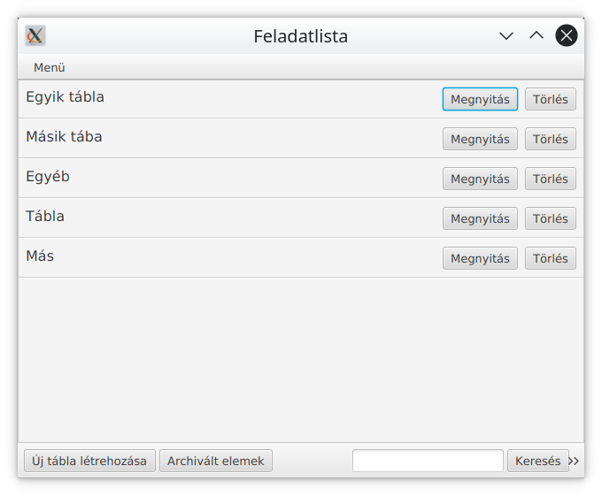
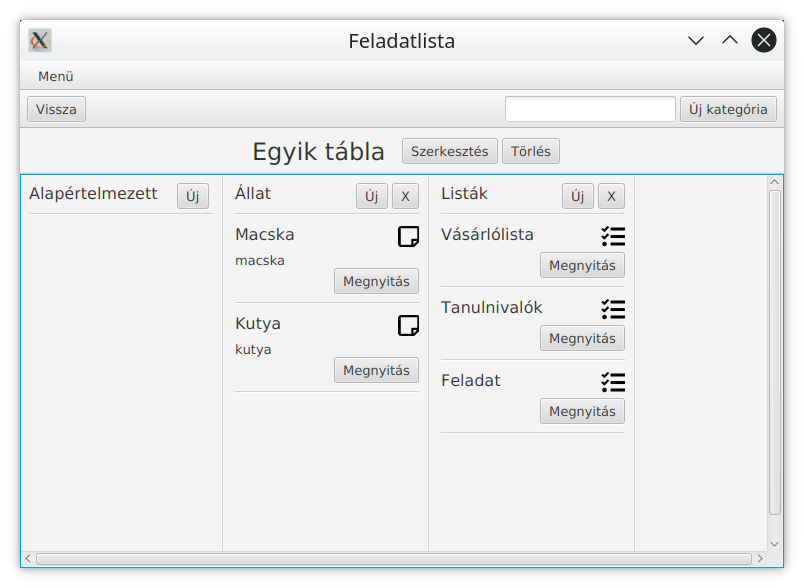
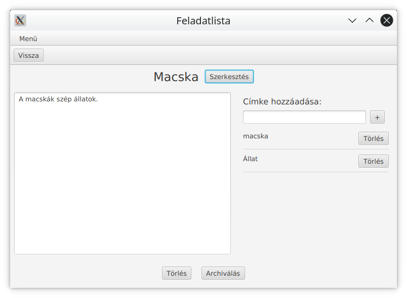
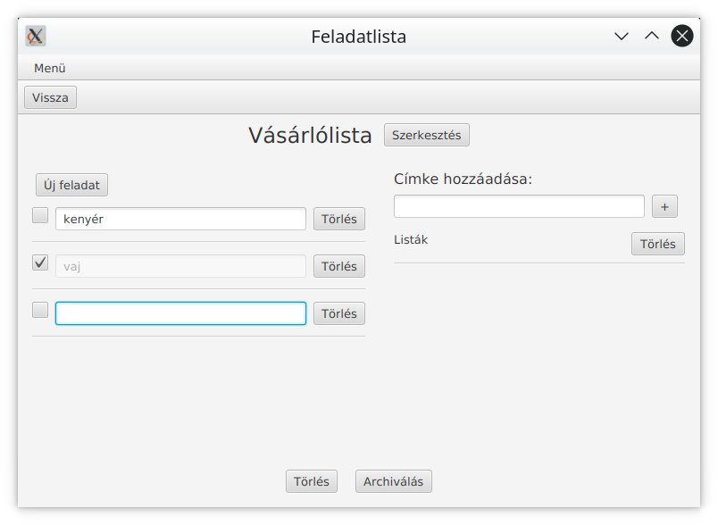
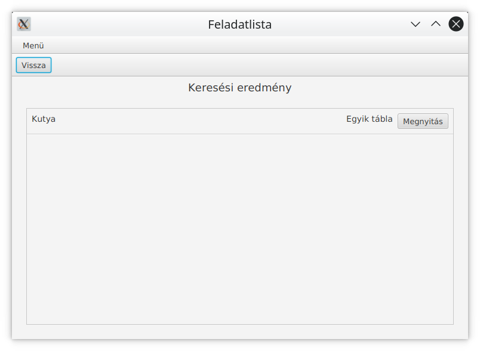
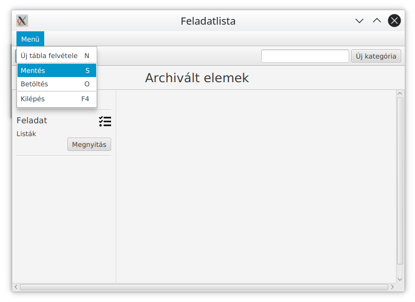
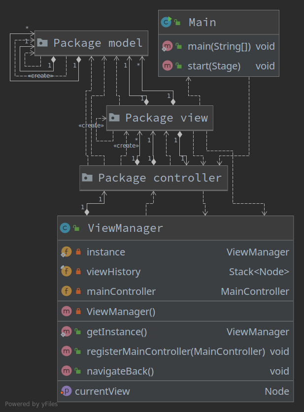
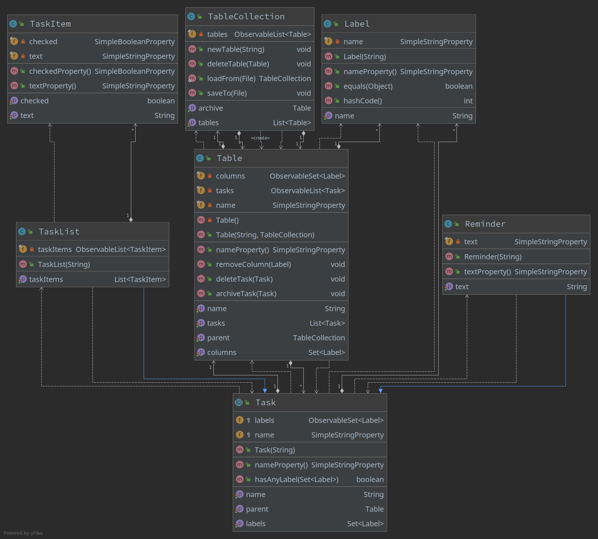
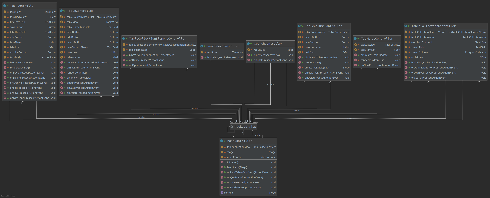
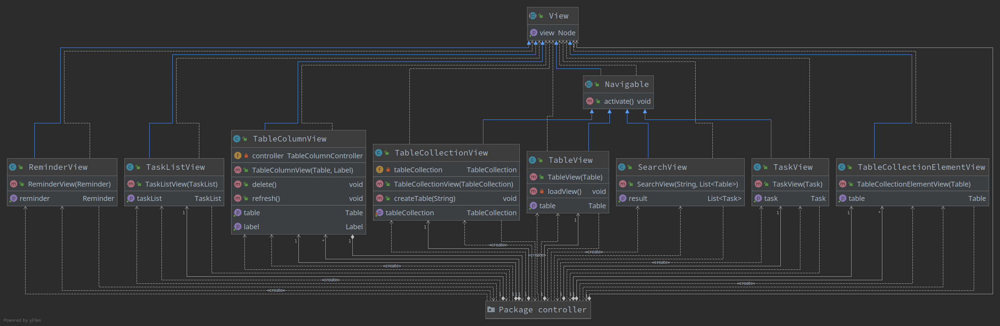

# Felhasználói dokumentáció

A házi feladatban egy grafikus feladatlista alkalmazást valósítottam meg. A programban lehetőség van táblák felvételére, melyeken belül kategóriákat lehet létrehozni. 

{ height=300px }

A kategóriákhoz lehet felvenni feladatlistákat és szöveges emlékeztetőket. Ezek külön-külön oszlopban jelennek meg a kategória alapján. A táblákban van egy alapértelmezett oszlop, amiben a címke nélküli, illetve a kategória szintű címkével nem rendelkező bejegyzések szerepelnek. A bejegyzések több oszlopban is megjelenhetnek, ha több olyan címke is szerepel rajta, amely kategória is.

{ height=300px }

Az egyes feladatlistáknak, emlékeztetőknek lehet címet adni, illetve ezekhez lehet címkéket hozzárendelni, levenni. Az emlékeztetőknél szabad szöveges részt lehet megadni, a feladatlistáknál pedig részfeladatokat lehet felvenni, melyek állapota jelölőnégyzettel változtatható. Az emlékeztetők, feladatlisták törölhetőek. A kategóriák is levehetőek, az olvan bejegyzések, amelyek nem rendelkeznek kategória szintű címkével, átkerülnek az alapértelmezett oszlopba.

{ height=300px }

{ height=300px }

A táblákban szereplő elemeket archiválni lehet, ami által az adott elem lekerül a táblájáról, és az archivált elemek közé kerül. Az archivált elemeket is lehetséges szerkeszteni, kategóriákba sorolni. Az archivált táblát nem lehet törölni, csak a benne szereplő bejegyzéseket lehetséges.

A keresés segítségével a feladatok címében tudunk keresni, a találatokat pedig egy listán jeleníti meg az alkalmazás.

{ height=300px }

A program mentéskor az adatokat egy fájlba menti, és betöltéskor ebből olvassa be azokat.

{ height=300px }

# Fejlesztői dokumentáció

A projekt `maven` támogatással van létrehozva. A fordításhoz szükséges függőségek automatikusan kezelve vannak. A tesztek a `Junit 4` könyvtár használatával vannak implementálva. A teszt környezet a `JaCoCo` plugin segítségével code coverage riportot is generál (`target/site/jacoco/index.html`).

A program fordítása és futtatása:
```
mvn javafx:run
```

A tesztek futtatása:
```
mvn test
```

## Osztályok szerkezete

Az osztályok 3 package-be kerültek, a `model` package-be a program belső osztályai kerültek, amik az adatokat tárolják. A `view` package-ben a megjelenítéssel kapcsolatos osztályok vannak. A `controller` package-ben a grafikus felület vezérlő osztályai kerültek.

{ height=420px }







## Adatszerkezetek, osztályok leírása, tervezési megfontolások

Az adatszerkezeteket megvalósító osztályok a `model` packageben találhatók (adatmodell). A feladatokat táblák tartalmazzák, ezeket a táblákat pedig egy táblagyűjtemény tartalmazza. A táblagyűjtemény osztály a `TableCollection`. Ebben az osztályban egy listában vannak tárolva a táblák (`tables` mező), az archivált elemeket tartalmazó tábla egy külön mezőben van tárolva (`archive` mező). A táblagyűjtemény szerializálásával a teljes feladat adatbázis menthető és betölthető. Erre a feladatra a `loadFrom` és `saveTo` függvények használhatók. Új tábla létrehozására a `newTable`, egy tábla törlésére pedig a `deleteTable` metódusok használhatók. A szerializáláshoz a `Jackson` függvénykönyvtárat használja az osztály.

A `Table` osztály egy feladatokat tároló tábla. A táblához tartozó feladatok egy heterogén kollekcióban a `tasks` mezőben vannak tárolva. A tábla nevét a `name` mező tárolja. A táblához lehet különböző oszlopokat is rendelni, minden címkéből maximum egyet, ezért a `columns` mező egy címkéket tároló halmaz. A `parent` mező a táblát tartalmazó gyűjtemény referenciája.

A `Label` osztály egy címkét reprezentál, ami egy szöveges érték (`name` mező). Az osztály később tetszőlegesen bővíthető más attribútumokkal (pl. szín) is. Az `equals` és a `hashCode` függvények felül vannak definiálva, hogy az osztályt a beépített kollekciókkal is használni lehessen.

A `Task` absztrakt osztály egy feladatot reprezentál. Minden feladatnak van neve (`name` mező), illetve tartozhatnak hozzá címkék (`labels` halmaz). A feladatok további tulajdonságait a konkrét implementációk határozzák meg. A `parent` mező a feladatot tartalmazó tábla referenciája.

A `Reminder` osztály egy szabad szöveges emlékeztető feladat. A `text` mező értéke egy tetszőleges szöveg lehet.

A `TaskList` osztály egy feladatlista implementáció. A `taskItems` mező a feladatlista elemeket tartalmazó lista. 

A `TaskItem` a feladatlista elemet megvalósító osztály. A `checked` mező értéke reprezentálja azt, hogy a feladat el van-e már végezve. A `text` mező értéke a feladatlista elem leírása.

A program JavaFX grafikus keretrendszer segítségével van megvalósítva. A keretrendszer az MVC mintát követi. Az egyes nézetekhez tartozó vezérlő osztályok (controller-ek) a `controller` package-ben találhatók. Ezek az osztályok felelősek a gombok és más vezérlőelemek eseményeinek kezeléséért. A `view` package-ben a nézetek betöltő, és azokat a modellel összekötő osztályok találhatók. Az egyes osztályok bővebb leírásai a forráskódban lévő JavaDoc kommentekben elérhetőek.

## Use-case-ek

A felhasználó a következő funkciókat hajthatja végre:

1. Táblák listázása  
A program indulásakor a felhasználó a táblák listáját látja. A táblák listája alatt új tábla létrehozása gomb és keresőmező szerepelnek. Az archivált elemek táblája is gombnyomásra érhető el, ezt nem lehet törölni.

2. Tábla megnyitása  
A táblák listázása oldalon egy meglévő tábla nevére kattintva megjelenik a kiválasztott tábla.

3. Új tábla létrehozása  
A táblák listázása oldalon a megfelelő gombra kattintva, vagy a menüből az új tábla létrehozását kiválasztva megjelenik egy felugró ablak, amiben meg lehet adni az új üres tábla nevét. Ezután az új tábla a táblák listájában megjelenik.

4. Tábla nevének szerkesztése  
A tábla megnyitása után a megfelelő gombra kattintva szerkeszthetővé válik a tábla neve, és megjelenik egy mentés gomb. A mentés gombra kattintva a tábla neve rögzítésre kerül, ha üres marad a szövegdoboz, akkor nem történik változás.

5. Tábla törlése  
A tábla megnyitása után a megfelelő gombra kattintva törölni lehet a táblát. A törléshez megerősítést kér a felhasználótól a program.

6. Új kategória felvétele  
A tábla nézetnél egy gomb és szövegmező segítségével új kategóriát lehet felvenni. A kategória egy oszlopként jelenik meg a táblán.

7. Kategória levétele a tábláról  
A kategóriához tartozó gombra kattintva az adott kategória levételre kerül a tábláról.

8. Új feladat létrehozása  
A kategórián belüli gombra kattintva az adott kategóriához új feladatot vehetünk fel. Az új feladat típusát egy felugró ablakban lehet kiválasztani, utána egy másik felugró ablakban a feladat nevét lehet megadni.

9. Feladat megnyitása  
A feladathoz tartozó gombra kattintva megjelenik az adott feladat. A feladat neve, a feladat szövege, a részfeladatok és a címkék ezen a képernyőn szerkeszthetők.

10. Részfeladat hozzáadása a feladathoz  
Új részfeladatot egy gomb segítségével tudunk felvenni a feladat szerkesztése képernyőn.

11. Részfeladat törlése  
Adott részfeladatot a hozzá tartozó gombbal tudunk törölni.

12. Részfeladat megjelölése  
A részfeladathoz tartozik egy jelölőnégyzet, amire kattintva a részfeladat megjelölésének állapota változtatható.

13. Címke hozzárendelése feladathoz  
A feladat szerkesztése képernyőn egy szövegdoboz segítségével a mellette lévő gombra kattintva vehetünk fel a feladathoz új címkét.

14. Címke levétele a feladatról  
A címke melletti gombra kattintva az adott címkét levehetjük a feladatról.

15. Feladat archiválása  
A feladat szerkesztése képernyőn az archiválás gombra kattintva a feladat átkerül az archivált elemek táblára. Az archiváláshoz megerősítést kér a felhasználótól a program.

16. Feladat törlése  
A feladat szerkesztése képernyőn a törlés gombra kattintva a feladat törlésre kerül. A törléshez megerősítést kér a felhasználótól a program.

17. Feladat keresése  
A táblák listájának oldalán a kereső mezőbe a kifejezést beírva megjelenik a találathoz tartozó feladatok listája. Az adott feladathoz tartozó gombra kattintva megnyithatjuk a feladatot. A keresés mező mellett kiválaszthatjuk, hogy az archivált elemek között is keressen-e.

18. Táblák mentése  
A menüben a mentést kiválasztva fájlba lehet menteni a táblák állapotát. Mentés előtt a felhasználótól megerősítést kér.

19. Táblák betöltése  
A menüben a betöltést kiválasztva fájlból be lehet olvasni a táblák állapotát. Betöltés előtt a felhasználótól megerősítést kér.

## Fájlok szerkezete
Az adatok JSON formátumú fájlban vannak tárolva. A táblagyűjtemény, valamint az azokhoz tartozó feladatok mind egy fájlba kerülnek kiírásra. A `Jackson` szerializáló könyvtár segítségével van implementálva a mentés és a betöltés. Az adatmodell osztályain lévő annotációk szabályozzák a kimeneti formátumot. A heterogén kollekció elemei egy `type` mező segítségével vannak megkülönböztetve, ezt a szerializáló az annotációk beállításai alapján hozza létre. Egy példa a mentett fájlra (`tasks.json`):

```json
{
    "tables": [{
        "name": "Egyik tábla",
        "columns": ["Állat"],
        "tasks": [{
            "type": "taskList",
            "name": "Vásárlólista",
            "taskItems": [{
                "checked": false,
                "text": "kenyér"
            }],
            "labels": ["Listák"]
        }, {
            "type": "reminder",
            "name": "Macska",
            "labels": ["Állat", "macska"],
            "text": "A macskák szép állatok."
        }]
    }],
    "archive": {
        "name": "Archivált elemek",
        "columns": [],
        "tasks": []
    }
}
```